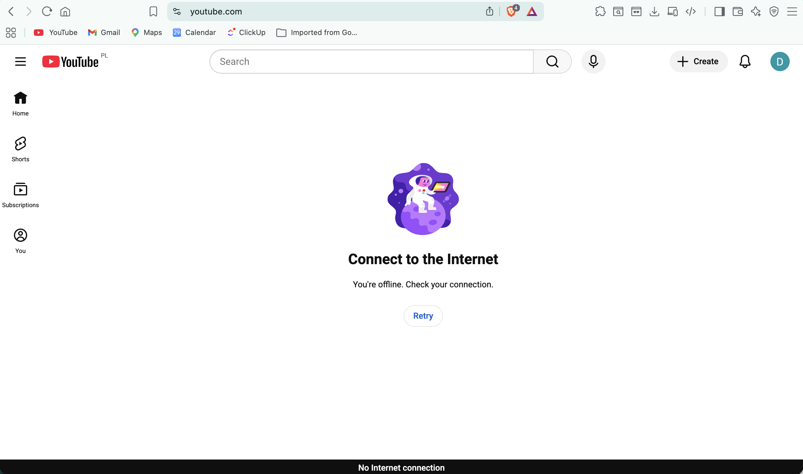
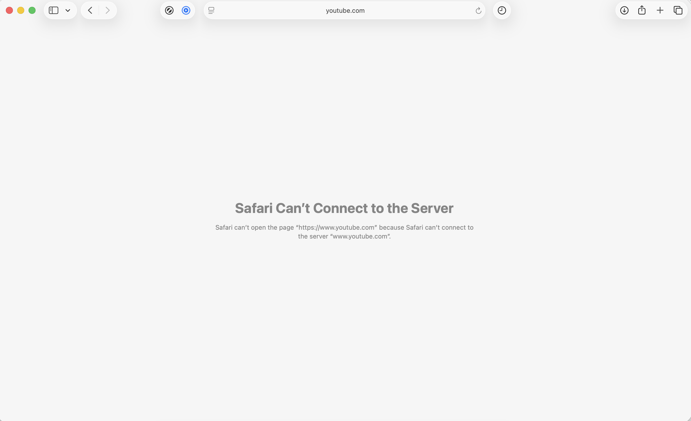
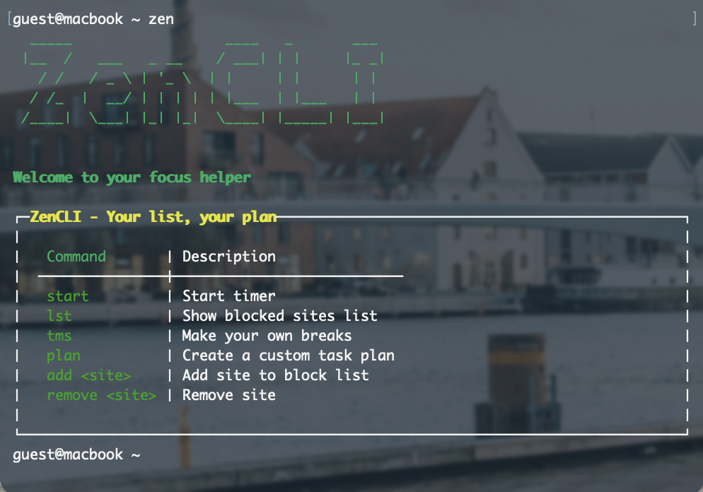
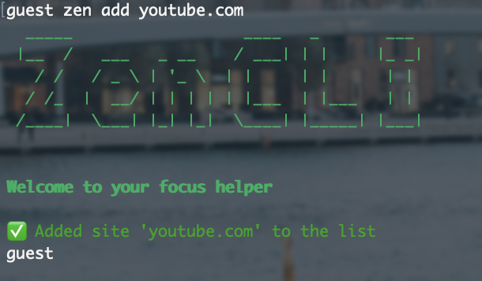
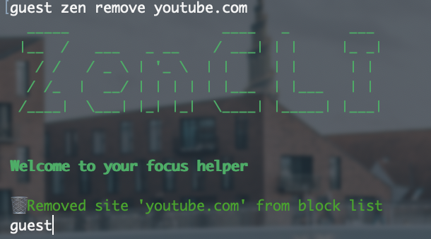
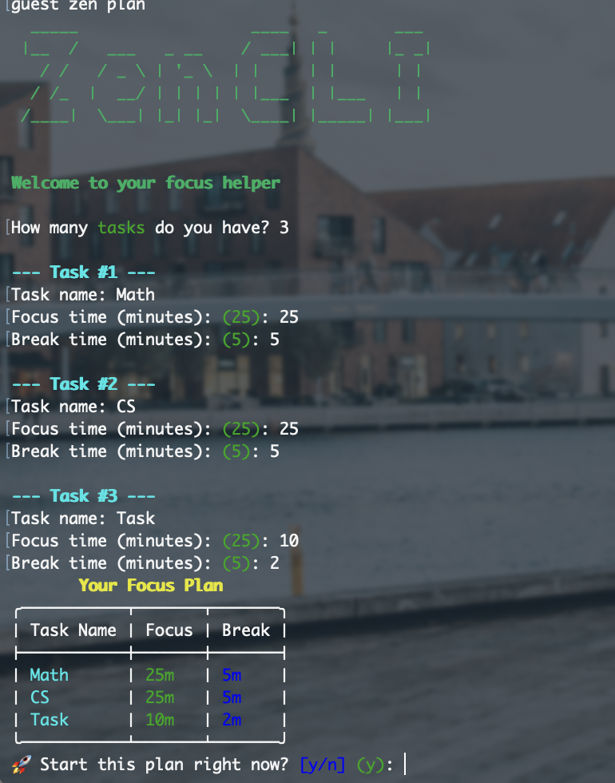
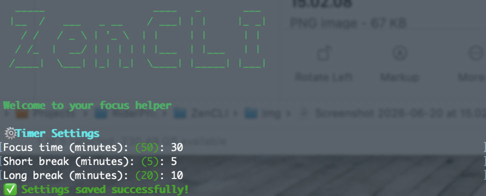
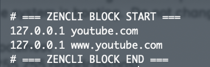

# 🧘 ZenCLI

> A hardcore macOS/Linux CLI tool that helps fight procrastination by taking control away from you.

Instead of relying on willpower, ZenCLI blocks distracting sites at the OS level during focus sessions — no browser extension, no incognito workaround.

---

## Features

- 🎬 **Sleek UI** — beautifully crafted terminal interface using `Spectre.Console` with dynamic boot animations and interactive progress bars.
- 🔒 **Hard blocking** — redirects traffic for blocked sites via `/etc/hosts`. Automatically handles `www.` prefixes and flushes macOS DNS cache for instant effect.
- 📝 **Custom Plans** — build a temporary, multi-task focus session with individual focus and break times. Clears from memory when done.
- ⏱ **Smart Pomodoro** — visual countdown with color-coded progress bars and automatic long/short break management.
- ⚙️ **Flexible config** — add or remove sites from the block list anytime via simple commands.
- 🛡 **Graceful shutdown** — if the process is killed (Ctrl+C), `/etc/hosts` is automatically restored and sites are unblocked instantly.

---

## Requirements

- macOS (Apple Silicon/Intel) or Linux
- [.NET 10 SDK](https://dotnet.microsoft.com/download) *(only needed if building from source)*
- `sudo` access (required to modify `/etc/hosts` and flush DNS)

> ⚠️ **Browser Note:** Works perfectly across all browsers! However, **Safari** has a particularly aggressive DNS cache and might occasionally bypass the block.
>
> 💡 **Important:** You do not need to refresh the blocked pages after starting the timer. Simply **close the tabs of distracting sites before** running the start command!

<p align="center">
  
  &nbsp;
  
</p>

---

## Installation

### Option 1 — Download binary (recommended)

1. Download the latest `zen` binary from [Releases](https://github.com/d4nilx/ZenCLI/releases)
2. Install it to your system path:

```bash
sudo cp zen /usr/local/bin/zen
sudo chmod +x /usr/local/bin/zen
```

3. Run it:

```bash
sudo zen start
```

### Option 2 — Build from source

Requires [.NET 10 SDK](https://dotnet.microsoft.com/download).

```bash
git clone [https://github.com/d4nilx/ZenCLI.git](https://github.com/d4nilx/ZenCLI.git)
cd ZenCLI
dotnet build
```

To publish a self-contained binary:

```bash
# macOS Apple Silicon (M-series)
dotnet publish -c Release -r osx-arm64 --self-contained true

# macOS Intel
dotnet publish -c Release -r osx-x64 --self-contained true

# Linux
dotnet publish -c Release -r linux-x64 --self-contained true
```

Then install:
```bash
sudo cp bin/Release/net10.0/<runtime>/publish/ZenCLI /usr/local/bin/zen
sudo chmod +x /usr/local/bin/zen
```

---

## Usage

> Commands that modify `/etc/hosts` require `sudo`.

### Start a focus session

```bash
sudo zen start
```

<p align="center">
  
</p>

Starts a classic Pomodoro timer using your configured duration and blocks all sites on your list. 
Use Ctrl+C to execute an emergency stop and unblock sites.

### Manage blocked sites

```bash
sudo zen add youtube.com       # Add a site to the block list
sudo zen remove youtube.com    # Remove a site from the block list
zen lst                        # View your current block list
```

<p> 
    
    
</p>

### Create a custom focus plan
```bash
sudo zen plan
```

<p> 
    
</p>

Interactive prompt to create a specific list of tasks for the day, each with custom focus and break times.
Automatically cycles through them and blocks distractions.

### Configure timer settings

```bash
zen tms
```

<p> 
    
</p>

Set focus duration, short break, and long break durations. Settings are saved to `~/.zencli/config.json`.

---

## Project Structure

```
ZenCLI/
├── Program.cs                 # Main orchestrator & Spectre.Console UI
├── Models/
│   ├── ZenConfig.cs           # Configuration models
│   ├── BreakSettings.cs       
│   └── PlanTask.cs            # Custom plan models
└── Services/
    ├── BlockingService.cs     # /etc/hosts manipulation & DNS flush
    ├── ConfigManager.cs       # JSON serialization
    └── PomodoroManager.cs     # Progress bars & async timer logic
```

---

## Config

Settings are stored at `~/.zencli/config.json`:

```json
{
  "BlockedSites": ["youtube.com", "reddit.com"],
  "Breaks": {
    "PomodoroDurationMinutes": 25,
    "ShortBreakDuration": 5,
    "LongBreakDuration": 15
  }
}
```

---

## Tech Stack

- **C# / .NET 10** — console app with `async/await` and `CancellationToken`
- **System.Text.Json** — config serialization
- **Spectre.Console** — advanced terminal UI components (spinners, tables, progress bars).
- **System.Diagnostics.Process** — native macOS commands execution (killall -HUP mDNSResponder)
- **`/etc/hosts`** — OS-level site blocking



---

## Status

🔄 **Optimizing Stability** — core features, custom plans, and system-level blocking are fully implemented. The current focus is on **real-world** testing and stability improvements.

---

*Built by [Daniil Zhdanov / @d4nilx](https://github.com/d4nilx)*
